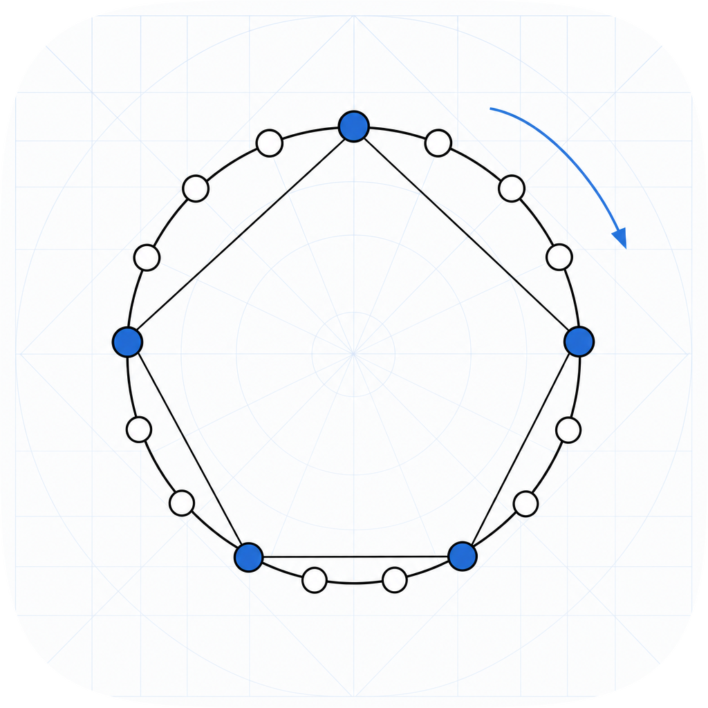

# euclidean-rhythm

<p align="center">
  
</p>

Generate Euclidean rhythms and analyze them with standard geometric measures, in pure Python with zero dependencies.

## What are Euclidean rhythms?

Euclidean rhythms distribute `k` onsets as evenly as possible over `n` time steps using
Bjorklund's algorithm - the same Euclidean GCD logic that underlies many traditional
musical patterns worldwide.

**The son clave** (3 onsets, 8 steps): `x . . x . . x .`
**The bossa nova clave** (5 onsets, 8 steps): `x . x x . x x .`

## Install

```sh
pip install euclidean-rhythm
```

> PyPI release pending. Install from source:
> ```sh
> git clone https://github.com/amaar-mc/euclidean-rhythm
> cd euclidean-rhythm
> pip install -e .
> ```

## Quick start

```python
from euclidean_rhythm import (
    euclidean,
    evenness,
    inter_onset_intervals,
    ioi_histogram,
    necklace,
    offbeatness,
    onset_positions,
    pattern_from_onsets,
    rhythmic_oddity,
    rotate,
    syncopation,
)

# Generate rhythms
son = euclidean(pulses=3, steps=8)
# [1, 0, 0, 1, 0, 0, 1, 0]

bossa = euclidean(pulses=5, steps=8)
# [1, 0, 1, 1, 0, 1, 1, 0]

# Rotate
rotate(son, steps=2)
# [0, 1, 0, 0, 1, 0, 1, 0]

# Canonical necklace form (rotation-invariant)
necklace(son) == necklace(rotate(son, steps=3))
# True

# Evenness (1.0 = maximally even)
evenness(euclidean(pulses=4, steps=8))
# 1.0

# Keith syncopation (0 = no syncopation)
syncopation(euclidean(pulses=4, steps=8))
# 0

# Pressing rhythmic oddity
rhythmic_oddity(son)
# True

# Off-beat onset count (Toussaint offbeatness)
offbeatness(son)
# 1  -- onset at position 3 is off-beat in n=8; 0 and 6 are on-beat

# Inter-onset intervals (gaps in pulses, wrapping)
inter_onset_intervals(son)
# [3, 3, 2]  -- sums to 8

# Histogram of inter-onset intervals
ioi_histogram(son)
# {3: 2, 2: 1}

# Convert between 0/1 pattern and onset-position list
onset_positions(son)
# [0, 3, 6]
pattern_from_onsets(positions=[0, 3, 6], steps=8)
# [1, 0, 0, 1, 0, 0, 1, 0]
```

## CLI

```sh
euclidean-rhythm 3 8
# x..x..x.

euclidean-rhythm 5 8
# x.xx.xx.
```

## API

All parameters are keyword-only.

| Function | Description |
|---|---|
| `euclidean(*, pulses, steps)` | Generate Euclidean rhythm (Bjorklund's algorithm) |
| `rotate(rhythm, *, steps)` | Rotate left by steps (mod len) |
| `necklace(rhythm)` | Lexicographically minimal rotation (canonical form) |
| `evenness(rhythm)` | Toussaint geometric evenness in (0, 1] |
| `syncopation(rhythm)` | Keith (1991) syncopation count |
| `rhythmic_oddity(rhythm)` | Pressing (1983) rhythmic oddity property |
| `offbeatness(rhythm)` | Count of onsets on off-beat positions (gcd-coprime to n) |
| `inter_onset_intervals(rhythm)` | Gaps in pulses between consecutive onsets, wrapping |
| `ioi_histogram(rhythm)` | Histogram of inter-onset interval lengths |
| `onset_positions(rhythm)` | Indices of onsets in a 0/1 pattern |
| `pattern_from_onsets(*, positions, steps)` | Build 0/1 pattern from onset indices |

## Measures defined

**Evenness** (Toussaint 2005): Place onsets on a unit circle; sum all pairwise chord
lengths; normalize by the maximum (equally spaced onsets). Score 1.0 means maximally even.

**Syncopation** (Keith 1991): Metric weight of position `i` is `n` for the downbeat
(`i=0`) and the largest power of 2 dividing `i` for `i>0`. A syncopation occurs when
an onset at a weak beat is followed by a rest at a stronger beat; the score accumulates
the weight difference.

**Rhythmic oddity** (Pressing 1983): True if no two onsets are diametrically opposite
on the rhythm circle (no pair partitions the cycle into two equal halves).

**Offbeatness** (Toussaint): For a cycle of n pulses, position p is off-beat iff
gcd(p, n) == 1 -- equivalently, p is not covered by any regular subdivision of the
cycle (union of {k*n/d} for proper divisors d of n). Offbeatness is the count of onsets
at such positions. Both characterizations produce identical off-beat sets, verified for
n in 2..64.

**Inter-onset intervals**: The sequence of gaps (in pulses) between consecutive onsets
around the cycle, wrapping from the last onset back to the first. Always sums to n.

## References

- Bjorklund, E. (2003). The theory of rep-rate pattern generation in the SNS timing system.
- Toussaint, G. (2005). The Euclidean algorithm generates traditional musical rhythms. BRIDGES.
- Keith, M. (1991). From Polychords to Polya: Adventures in Musical Combinatorics.
- Pressing, J. (1983). Cognitive isomorphisms between pitch and rhythm in world musics. Studies in Music.

## License

MIT. Copyright (c) 2026 Amaar Chughtai.
